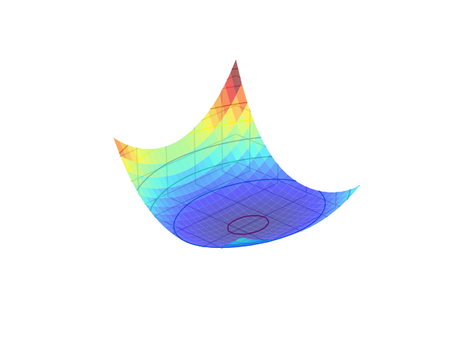
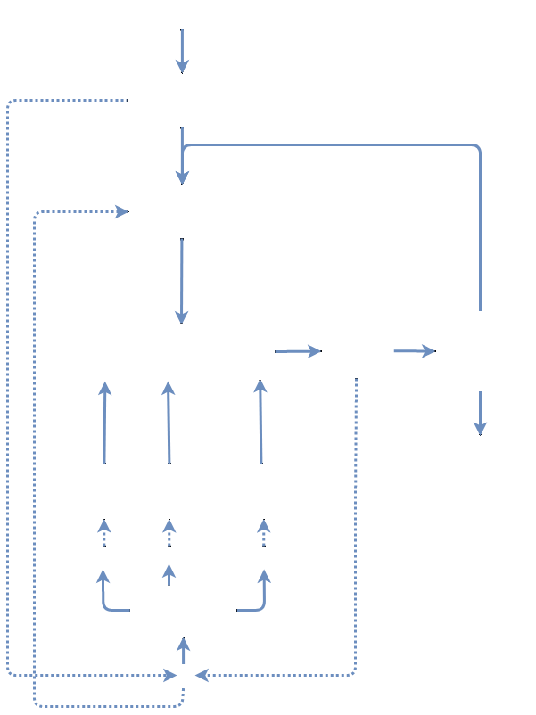

# Delving in the loss landscape to embed robust watermarks into neural networks
[](https://opensource.org/licenses/MIT)
[](http://dx.doi.org/10.1109/ICPR48806.2021.9413062)
[](https://youtu.be/coDIgb3n_LA)

```latex
    @INPROCEEDINGS{9413062,
    author={Tartaglione, Enzo and Grangetto, Marco and Cavagnino, Davide and Botta, Marco},
    booktitle={2020 25th International Conference on Pattern Recognition (ICPR)}, 
    title={Delving in the loss landscape to embed robust watermarks into neural networks}, 
    year={2021},
    pages={1243-1250},
    doi={10.1109/ICPR48806.2021.9413062}}
```
Link to the presentation: https://youtu.be/coDIgb3n_LA 


